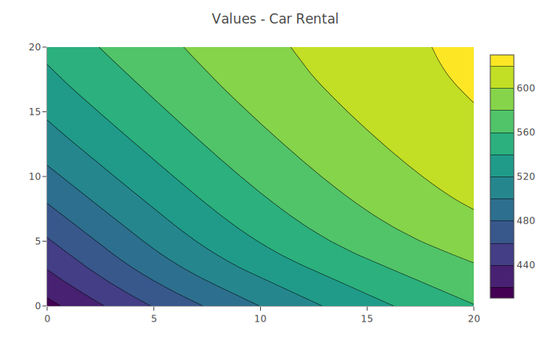
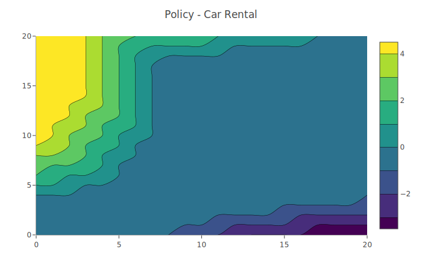
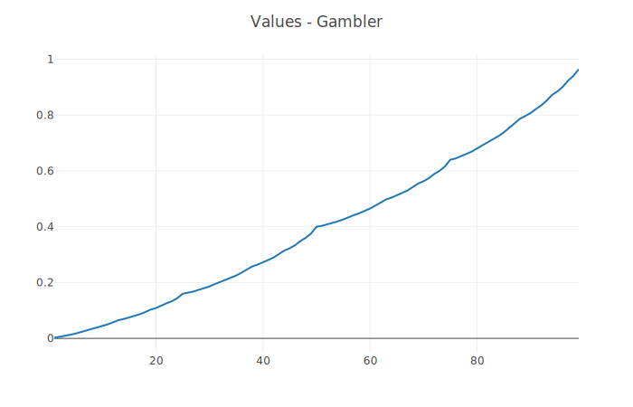
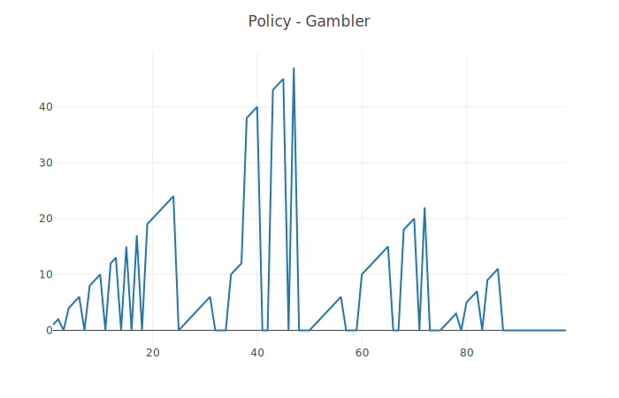

# Dynamic Programming

## Car Rental
Car rental location 1 has 3 cars returned and 3 cars rented from it per day on average. Location 2 has 2 cars returned and 4 cars rented from it per day on average. Each rental earns the company $10, and up to 5 cars can be moved overnight from one location to another at a cost of $2 per moved car.

Policy iteration is used to create a policy to transfer cars from location 1 to location 2 (or from location 2 to location 1 if the output from the policy is a negative number) that maximizes profit.

## Gambler's Problem
p_h = 0.4
A gambler is attempting to win $100. He wagers money and then flips a coin. If the coin lands on heads (with probability 0.4), the gambler gets double the value of his wager. If the coin lands on tails, he loses his wager. He can wager up to how much money he currently owns (but not enough that winning the wager would give him more than $100).

Value iteration is used to create a policy that wagers money based on the amount of money the gambler currently owns. Due to many equivalent optimal policies, the displayed optimal policy is just one of many (vastly different optimal policies can be generated from slight nuances in different implementations, although each optimal policy shares a somewhat triangular form when graphed).

