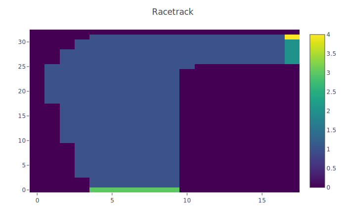
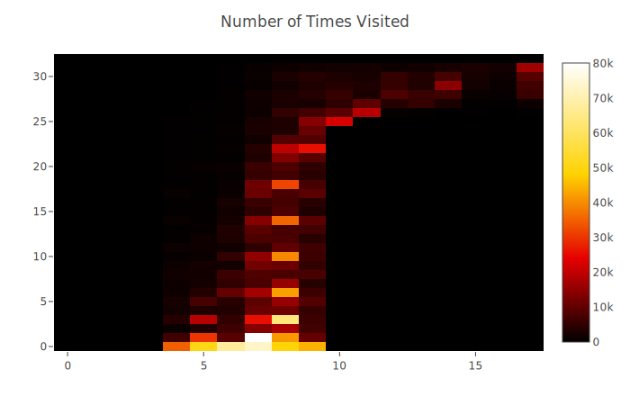
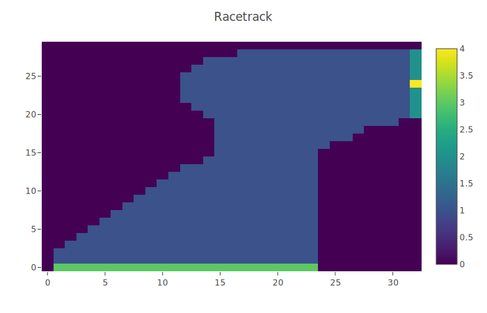

# Monte Carlo Methods

## Racetrack
Uses Off-Policy Monte Carlo Control to train a deterministic target policy to drive around a bend in a discretized racetrack. Weighted importance sampling is used to generate state value estimates for the target policy using only observations generated with an ε-greedy behavior policy.

### Tracks and State Frequency Maps
1. Track 1

2. Track 2

