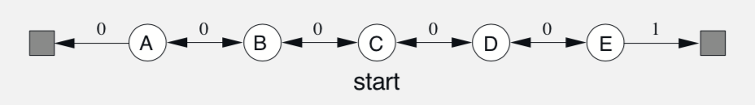
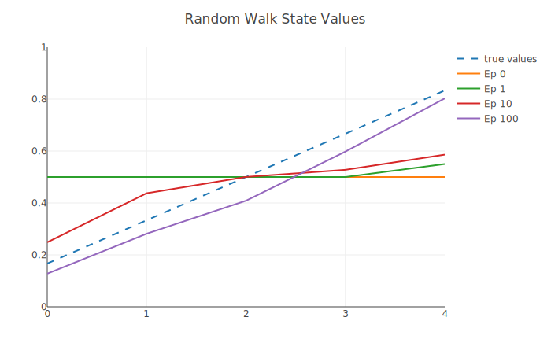
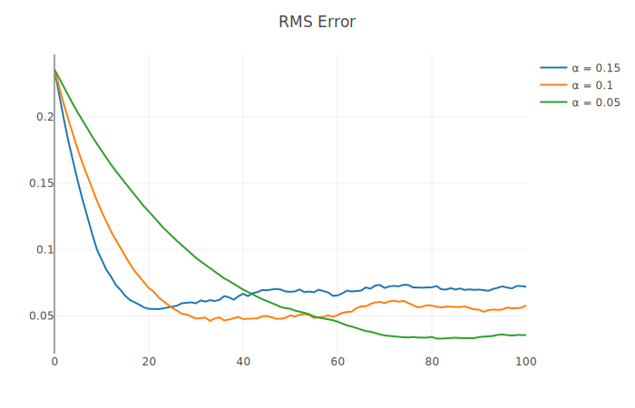
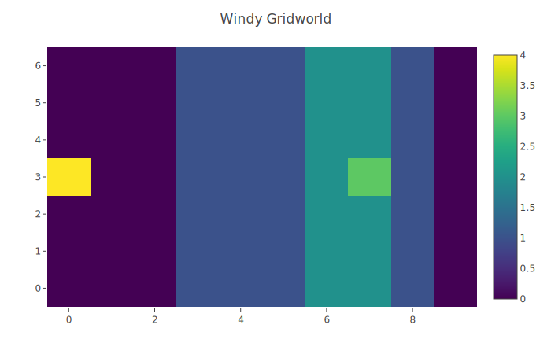
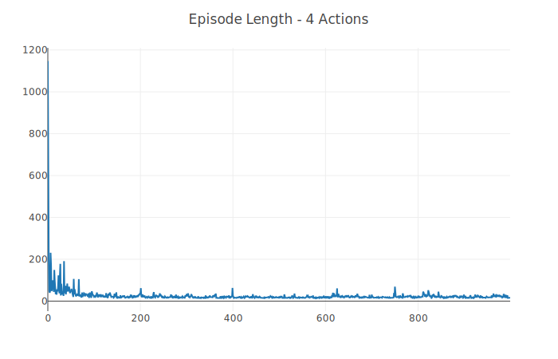
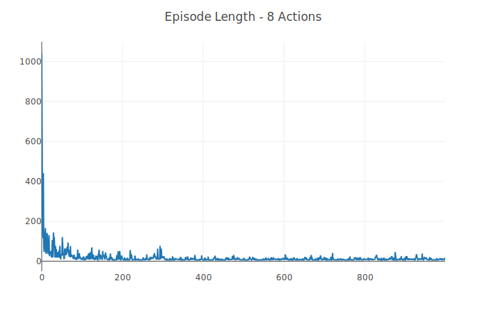
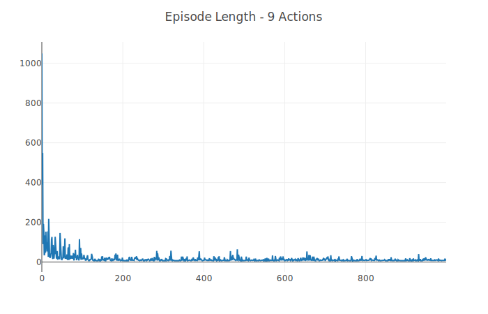
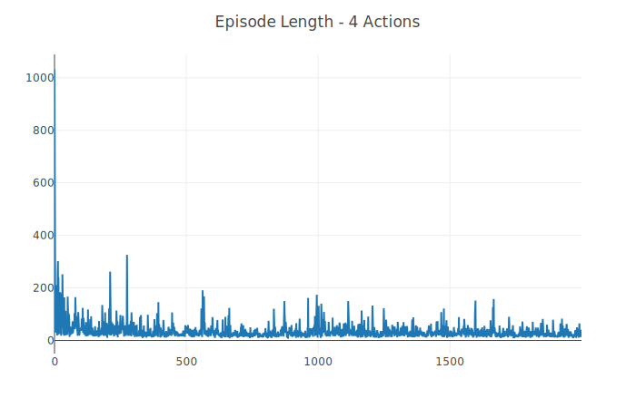
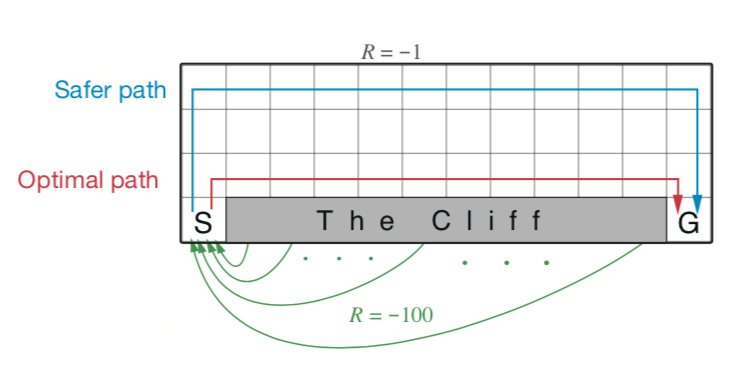
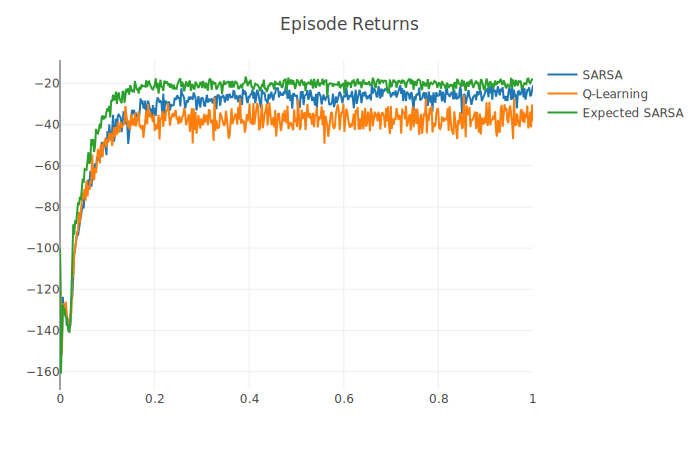

# Temporal-Difference Learning

## Random Walk
Two separate experiments are conducted using TD(0) on a small linear Markov Reward Process (MRP):

All episodes begin in state C

1. Convergence of state value estimates to the true state values over 100 episodes, ⍺ = 0.1

2. RMS error over 100 episodes using different ⍺ values, each averaged over 100 trials

## Windy Gridworld
An agent attempts to move from one position in a grid to another, but some columns in the grid have constant amounts of "wind" that pushes the agent upward during every move.

# Gridworld Map
Map of the windy gridworld. The agent (yellow) must reach the goal (green). Purple areas of the grid have no wind, blue areas move the agent an additional 1 tile upward every move, and the teal areas move the agent an additional 2 tiles upward.

# Agents
SARSA was used to train three agents that each had access to a different action space:

1. Four actions: up, down, left, right

2. Eight actions: all straight and diagonal directions

3. Nine actions: all straight and diagonal directions, plus an action to stand still (wind still has effect)

# Stochastic Variant
The environment was also tested with stochastic wind. Each column had an equal chance of either having wind with +1, -1 or the same strength as the map of the gridworld dictates. Below is the training graph for a four-action agent in this environment.

## Cliff Walking
An agent must move from one bottom corner of a grid to the other while avoiding all other tiles on the bottom of the grid, as shown below.

The SARSA agent tends to complete training episodes with higher returns due to the fact that it takes a safer path around the cliff. The Q-Learning agent converges to a lower average episodic return during training due to the fact that it takes a more optimal path around the cliff (the ε-greedy policy used during training causes it to randomly walk over the cliff more often than the SARSA agent does).

This difference in performance can be attributed to the fact that Q-Learning uses the maximum Q-value of the next state across all actions when updating its stored state-action values, whereas SARSA uses the current policy to choose the next action. Since the policy is ε-greedy, a SARSA agent traveling too close to the cliff will sometimes randomly walk off the cliff as the result of the chosen action and thus skew its estimates of the optimal Q-values.

The Expected SARA agent exhibits less variance than the SARSA agent due to the fact that its update rule includes the expectation over next state-action pairs instead of just sampling the next action from the policy.

