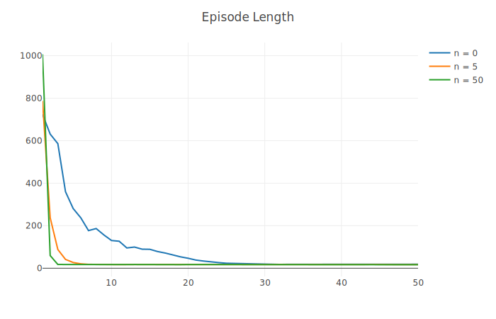
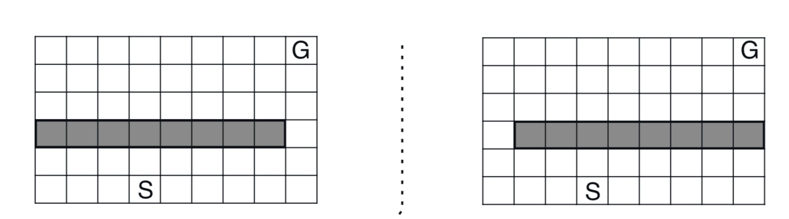
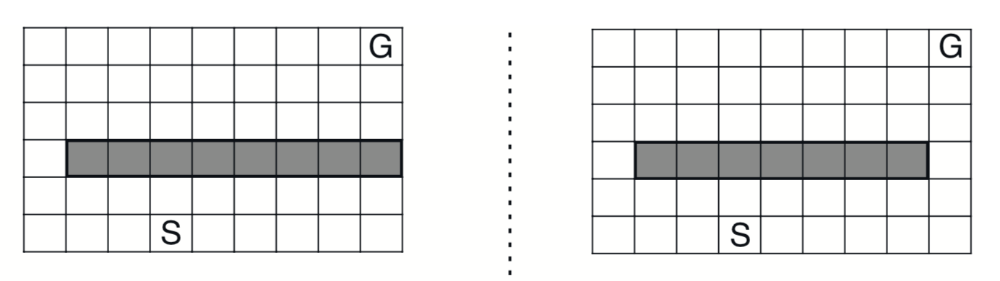
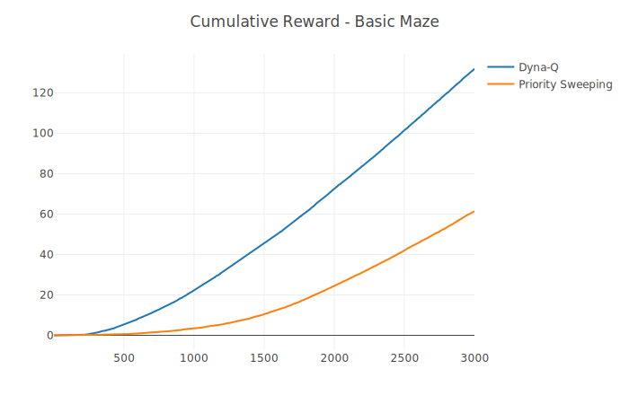
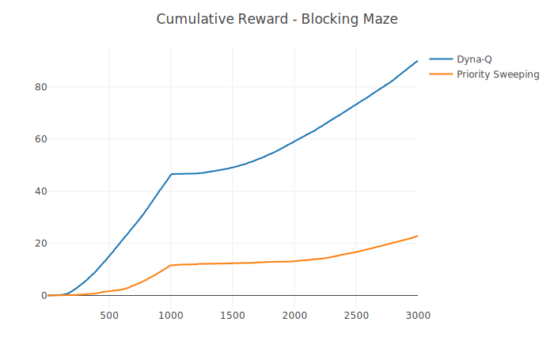
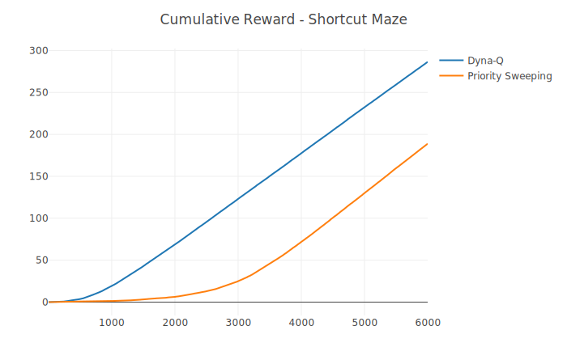

# Planning and Learning with Tabular Methods

## Dyna-Q
An agent must navigate around obstacles to the top right corner of a grid, with the grid and all four possible agent actions shown below:

The agent used Tabular Dyna-Q (a combination of one-step tabular Q-learning with model learning and planning) to efficiently determine the quickest route through the grid. The below graph shows how quickly the agents navigated through the grid each episode, where n denotes how many planning steps were taken every timestep. The higher the n value, the faster the agent was able to determine an optimal path. Each episode length is averaged over 100 trials.

## Priority Sweeping

Dyna_Q (while planning, states are randomly sampled) and Priority Sweeping (while planning, samples states according to which change estimated values the most) were compared on three mazes: the maze from the original Dyna-Q testing, as well as two mazes whose layouts changed after 1000 and 3000 timesteps, respectively:

The cumulative reward from training is displayed below:

Although Dyna-Q outperformed Priority Sweeping in terms of timestep efficiency, priority sweeping can be seen to significantly outperform Dyna-Q in terms of number of updates per training session.

|          | Dyna-Q  | Priority Sweeping |
|----------|---------|-------------------|
| Basic    | 1200000 | 18975             |
| Blocking | 1200000 | 115396            |
| Shortcut | 2400000 | 34038             |
