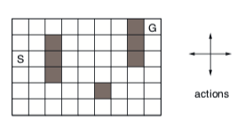
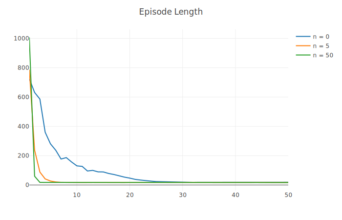

# Planning and Learning with Tabular Methods

## Dyna-Q
An agent must navigate around obstacles to the top right corner of a grid, with the grid and all four possible agent actions shown below:

The agent used Tabular Dyna-Q (a combination of one-step tabular Q-learning with model learning and planning) to efficiently determine the quickest route through the grid. The below graph shows how quickly the agents navigated through the grid each episode, where n denotes how many planning steps were taken every timestep. The higher the n value, the faster the agent was able to determine an optimal path. Each episode length is averaged over 100 trials.

## Dyna-Q+
