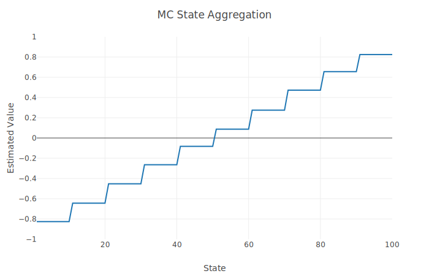
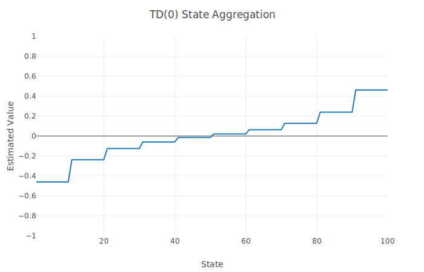

# On-Policy Prediction with Approximation

## Monte Carlo State Aggregation
Approximates the values of states in a 1000-step random walk using Monte Carlo and TD(0) variants of state aggregation. MC can be seen to work much faster than TD(0) in this environment, since rewards are only given at the end of each episode.

